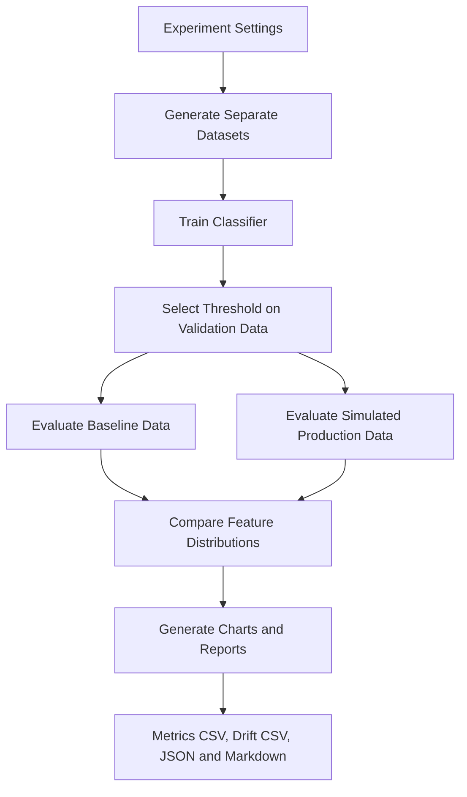

# ML Sentinel: Monitoring Model Reliability in Production

Machine-learning systems rarely operate in the same conditions forever.

The data available during training reflects one environment; the data arriving after deployment can gradually—or suddenly—look different. Transaction patterns change, customer behaviour evolves, and the relationship between input features and outcomes can shift.

**ML Sentinel** makes these changes observable. It builds a reproducible classification experiment, selects a decision threshold using validation data, evaluates a model on separate baseline and simulated-production datasets, measures feature drift, and produces reports and charts that help explain what changed.

The central question is simple:

> When a model moves from familiar data to changing production conditions, how can we measure its reliability and identify signals that deserve investigation?

---

## 1. The Experiment: From Data to Diagnosis

The pipeline is designed as a sequence of distinct stages. Each stage produces information used by the next, while keeping threshold selection separate from final evaluation.



The experiment uses synthetic transaction data so that the pipeline can be run reproducibly without requiring a private transaction dataset.

The production scenario is configurable. This run uses **Feature + concept drift**.

## 2. What the System Measures

### 2.1 Classification and Fraud Detection

The classifier estimates the probability that a transaction belongs to the positive class. A probability becomes an operational decision only after a threshold is selected.

The decision rule is:

$$
\hat{y} =
\begin{cases}
1, & \hat{p}(y=1 \mid x) \geq \tau \\
0, & \hat{p}(y=1 \mid x) < \tau
\end{cases}
$$

Where:

- \(x\) represents the transaction features.
- \(\hat{p}(y=1 \mid x)\) is the model's estimated positive-class probability.
- \(\tau\) is the decision threshold.
- \(\hat{y}\) is the predicted class.

A threshold of 0.5 is not automatically optimal. In fraud detection, false negatives can allow fraudulent transactions through, while false positives can send legitimate transactions for unnecessary review.

ML Sentinel selects the threshold using the validation set rather than tuning it on the final evaluation data.

### 2.2 Why the Data Is Separated

The pipeline creates four datasets with different responsibilities.

| Dataset | Purpose |
|---|---|
| Training | Fits the classifier. |
| Validation | Selects the decision threshold. |
| Baseline evaluation | Measures performance under a reference distribution. |
| Simulated production evaluation | Measures performance under the configured production scenario. |

Keeping the evaluation datasets out of threshold selection gives a more meaningful estimate of how the chosen operating point performs on data it was not tuned against.

### 2.3 Model Performance Metrics

The report includes complementary metrics because no single score captures every aspect of a classification system.

| Metric | Formula | Interpretation |
|---|---|---|
| Accuracy | \(\frac{TP+TN}{TP+TN+FP+FN}\) | Fraction of all predictions that are correct. |
| Precision | \(\frac{TP}{TP+FP}\) | Fraction of flagged transactions that are positive. |
| Recall | \(\frac{TP}{TP+FN}\) | Fraction of positive transactions detected. |
| F1 score | \(\frac{2PR}{P+R}\) | Harmonic mean of precision and recall. |
| ROC-AUC | Area under the ROC curve | Measures ranking performance across classification thresholds. |
| PR-AUC | Area under the precision-recall curve | Measures precision-recall performance, particularly useful for imbalanced datasets. |

Here:

- \(TP\): True positives
- \(TN\): True negatives
- \(FP\): False positives
- \(FN\): False negatives
- \(P\): Precision
- \(R\): Recall

## 3. Detecting Changes in Incoming Data

Good predictive performance on historical data does not guarantee that the input distribution will remain stable.

ML Sentinel compares production features with their baseline counterparts using two complementary measures.

### 3.1 Kolmogorov-Smirnov (KS) Test

The two-sample KS statistic measures the maximum distance between the empirical cumulative distribution functions of two samples.

$$
D = \sup_x \left|F_{\text{baseline}}(x) - F_{\text{production}}(x)\right|
$$

A larger \(D\) indicates a greater difference between the observed distributions.

The KS p-value provides statistical evidence against the hypothesis that both samples come from the same distribution. With large samples, even modest differences can produce small p-values, so the statistic should be interpreted alongside effect size and domain context.

### 3.2 Population Stability Index (PSI)

PSI summarises how the proportions in corresponding feature bins change between a baseline and a comparison dataset.

$$
\mathrm{PSI} = \sum_{i=1}^{k}(p_i-q_i)\ln\left(\frac{p_i}{q_i}\right)
$$

Where:

- \(p_i\) is the baseline proportion in bin \(i\).
- \(q_i\) is the production proportion in bin \(i\).
- \(k\) is the number of bins.

Larger PSI values indicate a greater shift in the binned distribution. PSI is a monitoring signal, not proof that model quality has degraded.

Using both measures helps distinguish a statistically detectable difference from a shift that is also substantial under the PSI calculation.

A flagged feature is a prompt for investigation—not, by itself, proof of a root cause.

## 4. Model and Implementation

The experiment trains a `HistGradientBoostingClassifier`, a tree-based boosting model that builds an ensemble of decision trees sequentially.

Each new tree helps improve the ensemble's predictions based on errors made by the existing model.

### Technology Stack

| Component | Technology |
|---|---|
| Programming language | Python |
| Data manipulation | pandas, NumPy |
| Machine learning | scikit-learn |
| Statistical testing | SciPy |
| Visualisation | Matplotlib |
| Interactive dashboard | Streamlit |
| Experiment outputs | CSV, JSON, Markdown, PNG |

The main pipeline runs the experiment and writes its artifacts to a timestamped directory. The Streamlit interface provides an interactive way to inspect the monitoring workflow.

## 5. Results from the Recorded Run

The run completed on **4 October 2026**, using random seed `42`, 12,000 training rows, and 2,500 rows in each evaluation dataset.

The configured production scenario was **Feature + concept drift**.

### 5.1 Dataset Profile

| Dataset | Rows | Positive / Fraud Rate |
|---|---:|---:|
| Training | 12,000 | 4.26% |
| Validation | Generated separately | 4.52% |
| Baseline evaluation | 2,500 | 4.96% |
| Simulated production evaluation | 2,500 | 13.24% |

The production scenario has a higher positive-class rate than the baseline, creating a useful test of how the monitoring workflow behaves when conditions change.

### 5.2 Decision Threshold

The validation stage selected a threshold of **0.135**, with a validation F1 score of **0.2222**.

This threshold was held fixed for both evaluation datasets, making the baseline and production results directly comparable at the same operating point.

### 5.3 Evaluation Metrics

| Metric | Baseline Evaluation | Simulated Production |
|---|---:|---:|
| Accuracy | 0.9156 | 0.7836 |
| ROC-AUC | 0.7523 | 0.6924 |
| PR-AUC | 0.1498 | 0.2885 |
| Precision | 0.1958 | 0.2866 |
| Recall | 0.2258 | 0.4260 |
| F1 score | 0.2097 | 0.3426 |

The results demonstrate why multiple metrics should be reported together.

Under the simulated production scenario:

- **Recall increased** from 0.2258 to 0.4260.
- **Precision increased** from 0.1958 to 0.2866.
- **PR-AUC increased** from 0.1498 to 0.2885.
- **F1 score increased** from 0.2097 to 0.3426.
- **Accuracy decreased** from 0.9156 to 0.7836.
- **ROC-AUC decreased** from 0.7523 to 0.6924.

The production dataset also contains a substantially higher positive-class rate. These metrics must therefore be interpreted in the context of the changed class balance and the simulated data-generation process—not as evidence that production is universally easier or harder.

The fixed threshold makes the trade-off visible: recall rises while accuracy falls. This is why production monitoring should report class prevalence and several performance metrics rather than relying on accuracy alone.

### 5.4 Feature Drift Results

The pipeline flagged **4 of 5 features** in the production comparison.

| Feature | KS Statistic | KS p-value | PSI | Flagged |
|---|---:|---:|---:|---|
| `merchant_risk` | 0.23120 | 0.00000* | 1.51934 | Yes |
| `distance_from_home_km` | 0.37920 | 0.00000* | 0.98551 | Yes |
| `transactions_24h` | 0.34240 | 0.00000* | 0.71909 | Yes |
| `amount` | 0.20960 | 0.00000* | 0.23694 | Yes |
| `account_age_days` | 0.02000 | 0.69948 | 0.00439 | No |

\* `0.00000` represents a p-value rounded to five decimal places in the printed output. It should be interpreted as a very small value, not an exact probability of zero.

The largest PSI was observed for `merchant_risk`, followed by `distance_from_home_km` and `transactions_24h`.

In contrast, `account_age_days` showed little distributional change.

These measurements give an analyst a concrete starting point for investigating which inputs changed most between baseline and simulated production.

Because the production data is simulated, these findings demonstrate the monitoring pipeline's behaviour under a controlled scenario. They do not establish real-world fraud rates or guarantee that the same pattern will occur in a live system.

## 6. Reproducibility and Generated Artifacts

Each execution creates a timestamped folder under `outputs/`, keeping results from different runs separate.

### 6.1 Generated Files

| Artifact | Purpose |
|---|---|
| `report.md` | Human-readable experiment and monitoring report. |
| `metrics.csv` | Baseline and production classification metrics. |
| `drift_report.csv` | KS statistics, p-values, PSI values, and drift flags. |
| `run_summary.json` | Machine-readable summary of the run. |
| `training_data.csv` | Generated training dataset. |
| `validation_data.csv` | Generated threshold-selection dataset. |
| `baseline_evaluation_data.csv` | Baseline evaluation dataset. |
| `production_evaluation_data.csv` | Simulated production evaluation dataset. |
| `confusion_matrix_production.png` | Production confusion-matrix chart. |
| `feature_psi.png` | Feature PSI chart. |

### 6.2 Configurable Experiment Settings

The default run uses 12,000 training rows and 2,500 rows per evaluation dataset.

Experiment settings can be adjusted through environment variables:

```powershell
$env:ML_SENTINEL_TRAIN_ROWS = "12000"
$env:ML_SENTINEL_EVAL_ROWS = "2500"
$env:ML_SENTINEL_SEED = "42"
$env:ML_SENTINEL_SCENARIO = "Feature + concept drift"
```

Supported scenarios:

- `Baseline`
- `Feature drift`
- `Feature + concept drift`

## 7. Running the Project

### 7.1 Create a Virtual Environment

```powershell
python -m venv .venv
.\.venv\Scripts\Activate.ps1
```

### 7.2 Install Dependencies

```powershell
python -m pip install -r requirements.txt
```

### 7.3 Run the Monitoring Pipeline

```powershell
python main.py
```

The pipeline generates the experiment results, evaluation metrics, drift reports, charts, and structured output files under `outputs/`.

### 7.4 Launch the Streamlit Dashboard

```powershell
python -m streamlit run app.py
```

Use `python -m streamlit run app.py` to start the Streamlit application. Running `python app.py` directly does not launch the Streamlit server correctly.

## 8. Interpreting the Findings

ML Sentinel brings together three connected views of reliability.

**1. Predictive performance**

Measures what the classifier gets right and wrong at a fixed operating threshold.

**2. Input stability**

Identifies which feature distributions have moved relative to the baseline.

**3. Reproducible evidence**

Provides reports, tables, charts, and structured outputs that make each experiment inspectable.

The recorded experiment illustrates why these views belong together. The production simulation changed the positive-class rate, shifted four monitored feature distributions, and produced a different balance of classification metrics.

Rather than reducing these observations to a single pass/fail score, the report preserves the evidence needed to decide what should be investigated next.

---

**The goal is not merely to train a model, but to make its behaviour measurable as the data environment changes.**
